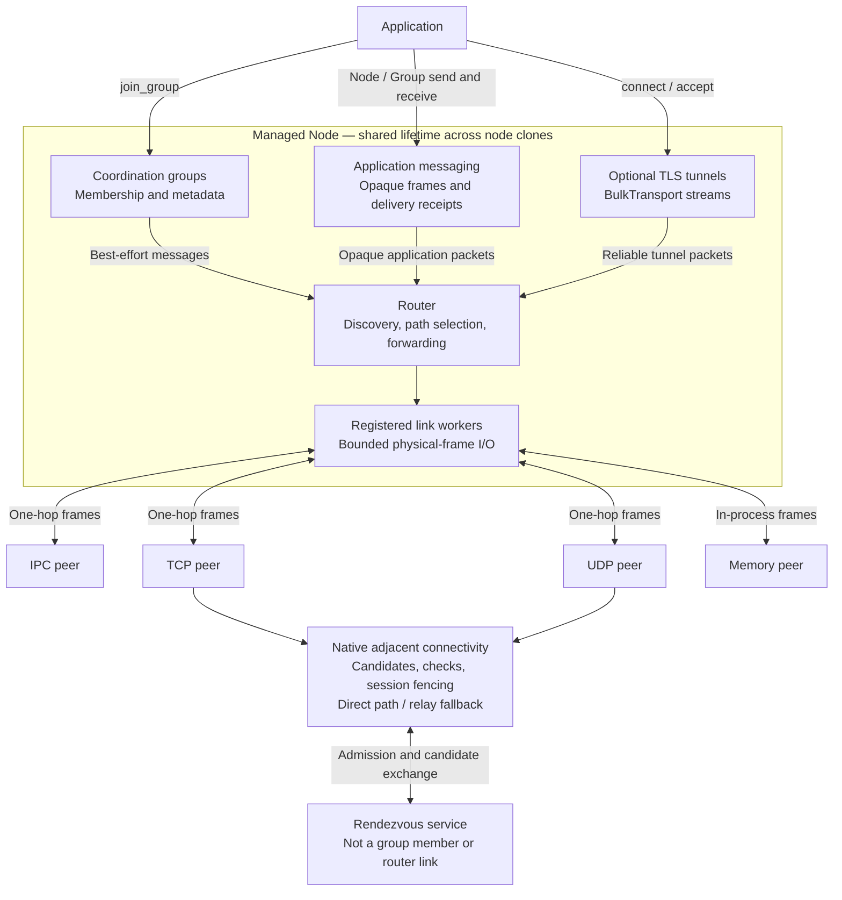
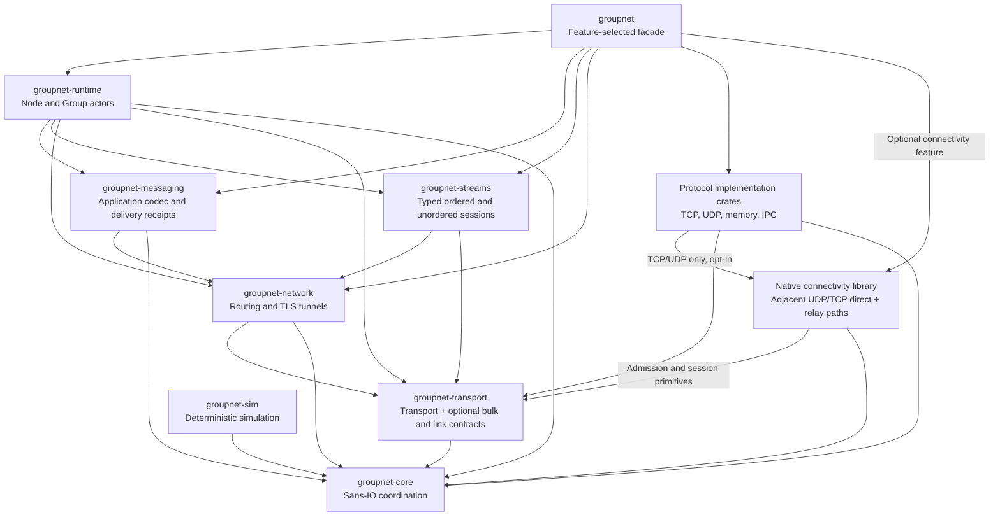
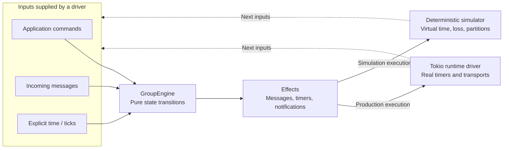

# Architecture diagrams

[Documentation index](README.md) · [Next: registration and lifecycle](link-lifecycle.md)

These diagrams describe the implemented managed-network architecture. Optional
consistency modes have their own [contract](consistency-modes.md); the diagrams
below do not imply that ordinary coordination groups provide consensus or access
control.

## 1. From application to physical links

A non-generic `Node` owns coordination and its routed network. Applications
address logical `NodeId` values, not a particular TCP connection or IPC pipe.
The router selects an adjacent peer and link for each destination.

Routing is intrinsic to every runtime node. Applications and tests use
`Node::builder(id).link(provider).start().await`; all protocol choices produce
the same `Node` type. `NetworkConfig::bind` starts a standalone routed `Network`
without the node's membership actors.

Applications such as docstore, docres, and s3cache use this domain-neutral layer
for groups, peer-addressed traffic and coordination; application data and access
policy remain above it. TCP/UDP adapters may consume the native connectivity
library to establish and maintain adjacent direct or relayed paths. That library
does not implement a transport or logical route bridging.

A memory-only node A reaches TCP-only C through edge B, which owns both protocols.
If A gains compatible admitted network connectivity to C, routing may prefer its
cheaper one-hop route and fall back through B after that adjacency fails. Group
discovery supplies hints, not permission to create arbitrary adjacent sessions.

### Application messages and receive ownership

Node-addressed and group-addressed application frames use a separate routed
payload kind and bounded inboxes; they never enter the coordination decoder or
compete with TLS stream acceptance. Payloads are opaque bytes with original
sender, optional group, and message identity retained at the receiver.

`groupnet-messaging` owns the application codec, endpoint, receipt state, retries,
and deduplication. `groupnet-network` only routes opaque application packets
through bounded protocol-ID queues; it never decodes the message body or
interprets an application ACK. `groupnet-runtime` attaches node/group inboxes,
serial callbacks, and membership-snapshot fanout reports to the endpoint.
The static `MessageProtocol` trait allows protocol-specific options and receipts;
`Frame<R>` and `MessageContext<R>` preserve those receipts without a payload copy.

`send` defaults to best effort. Explicit delivery options distinguish receiver
queue acceptance (`Delivered`) from application acknowledgement (`Applied`).
Acknowledged sends have bounded deadlines and retry/deduplication state; timeout
means unknown outcome, never proof that the application did not act. These are
trusted-fabric messages, not an implicit authenticated or encrypted channel.
Pinned TLS streams and TLS-bootstrapped encrypted unordered sessions provide
confidential authenticated application transport.

Group sends resolve a snapshot of the local membership internally, exclude the
sender, and return per-recipient outcomes. Departures do not shrink an in-flight
receipt requirement; later joiners receive no implicit replay. Group membership
is not authentication. Existing metadata, Hosted/quorum commit, feed/frontier,
and coherence-lease APIs retain their own contracts; an application message is
not silently converted into a replicated commit because its group is Hosted.

Each node inbox and each group inbox has one receive owner at a time. `recv`
returns `(MessageContext, Bytes)`; `recv_frame` returns a full `Frame`. These are
equivalent lossless representations: `Frame::into_parts` moves every field into
the context and payload without cloning metadata or receipts or copying bytes.
The context preserves message `id`, original `from` (not the forwarding bridge),
optional `group`, and receipt. Its `delivery()` reports the requested boundary,
`receipt()` returns an independent receipt handle, `applied()` acknowledges
successful processing, and `reject(error_kind)` rejects processing. Moving or
dropping the payload does not invalidate the context's receipt.

`on_recv` receives `(MessageContext, Bytes)` as two callback arguments;
`on_frame` receives a full `Frame`. All four APIs share one queue and the same
exclusive receive ownership, with no duplicate deliveries or payload copy when
selecting buffers. Neither manual receive automatically acknowledges `Applied`;
call `context.applied()` or `frame.applied()` after successful processing.
Both callback variants retain a receipt internally for automatic success
acknowledgement even when application code moves or drops the context/frame and
payload. A competing receiver fails with `WouldBlock` instead of stealing
messages. Callbacks execute serially outside the coordination loop; successful
completion acknowledges application, failure is surfaced through the callback
handle, and cancellation never acknowledges unfinished work. Dropping/closing
that handle cancels its worker and releases receive ownership. Network shutdown
also cancels blocked receives and callbacks.

### Typed sessions and logical peers

`node.endpoint(implementation)?` creates an `Endpoint
` handle for a concrete
protocol; `node.peer(id, implementation)?` creates its destination-bound
`Peer
`. Both use the same public unsealed binding contract and retain managed
node lifetime. `Messages`, `Ordered`, and `Unordered` descriptors bind their
delivery/setup options once and resolve the node's shared protocol state
internally. Creating either handle does not establish a connection, allocate a
per-peer receive queue, or require dynamic dispatch. Node-wide capacities and
timers are configured separately from per-handle options.

The lower-level `MessageProtocol` and `SessionProtocol` traits retain concrete
receipt/session types and static send/connect futures. Ordered sessions supply
reliable TLS bytes; unordered sessions supply whole authenticated messages under
an explicit reliable or unreliable policy. Reliable unordered messages
acknowledge inbox acceptance and retry independently; missing earlier messages
never block later arrivals. Unreliable messages add no data ACK/retry.
Underlying TCP routes retain their native transport behavior.

Protocol state is shared per node, not replaced by an enum or multiplexed public
receive type. Message endpoints receive from the existing runtime inbox and obey
its exclusive receive ownership; they never compete for the messaging worker's
raw receive queue. Ordered application accepts and unordered TLS setup have
separate authenticated namespaces; unordered accepts respect the selected
delivery policy. Application datagrams use their own routed protocol ID.
Unordered keys derive from the pinned TLS exporter and payloads bypass the
ordered control stream. Revocation and shutdown invalidate both the retained
control session and its datagram keys. See
[session bounds and usage](../README.md#typed-message-and-session-protocols).

## 2. Crate dependency boundaries

Arrows mean **depends on**, not packet flow. This is the relevant production
subgraph, not an exhaustive workspace/dependency listing. Application packet flow
is `runtime -> messaging/streams -> network -> transport`; runtime also uses
network directly for coordination and TLS streams. Disabling the facade's
default features keeps the core-only surface.

There is deliberately **no network-to-protocol dependency**. A protocol implements
`LinkProvider` in its own crate; an application registers it without editing a
router enum or match. IPC is a protocol implementation; the punch crate is an
independent connection library beneath TCP/UDP, not another router link.
`groupnet-core` never depends on Tokio, a clock, or a transport implementation.

## 3. One pure engine, two execution environments

Both drivers supply inputs to the same synchronous engine. The real runtime
executes effects with timers and I/O; the simulator executes them against its
virtual clock and simulated network. Neither driver moves sockets into the core.

A derived coordinator is a convergent coordination choice, not authority to
commit writes. Epoch-fenced authority belongs to the explicitly selected Hosted
mode described in the consistency contract.

## Coordination model

A group is a logical shard/partition coordination scope, not a security group.
Each node can join multiple groups; each group actor owns its own engine and
serializes its local state transitions. The base Eventual mode combines:

- SWIM-style direct and indirect probes, suspicion/refutation, and dead-member
  tombstone reaping. Membership is observer-local during failure and partition.
- Digest/delta anti-entropy for membership, TTL'd per-node keyed entries, and
  last-writer-wins metadata registers.
- A derived coordinator selected with stable rendezvous hashing over the group
  and live member IDs (Alive or Suspect, not Dead). Equal converged views compute
  the same coordinator; different partition views can compute different ones.

The derived coordinator neither serializes nor commits application writes.
Session feeds, applied acknowledgements, coherence leases, and Hosted
epoch-fenced authority are explicitly selected
[consistency tiers](consistency-modes.md), not implicit properties of gossip.
Groupnet does not provide a general replicated log or database.

### Metadata routing versus packet routing

Two APIs use the word routing:

| API | What it resolves | Source of the local view |
|---|---|---|
| `Node::routing()` | Resource to owning group, group to coordinator | LWW metadata in the reserved coordination group |
| `node.router().route_to(&peer)` | Logical peer to physical next hop and link | Adjacent-peer path advertisements |

Neither lookup is an authorization decision or a globally authoritative
ownership transaction. An application can use the metadata map to choose a peer,
then send through the physical router. Both views can be incomplete or stale
while converging; protected ownership still needs the appropriate authority.

### Local operation batching is not a barrier

`Group::sync` runs a closure that stages commands and enqueues them into the
bounded group inbox. It is fire-and-forget and best-effort under backpressure;
it does not await cluster-wide application, make a distributed transaction, or
establish a read-your-writes barrier. Use the relevant consistency tier when
those stronger guarantees are required.

## Implementation references

- [Workspace architecture and feature selection](../README.md#workspace-layout)
- [Managed node initialization](../crates/groupnet-runtime/src/node/builder.rs)
- [Shared registration contracts](../crates/groupnet-transport/src/link.rs)
- [Network ownership and standalone binding](../crates/groupnet-network/src/config.rs)
- [Application codec and delivery endpoint](../crates/groupnet-messaging/src/lib.rs)
- [Runtime callbacks and fanout reports](../crates/groupnet-runtime/src/messaging.rs)
- [Group engine membership and anti-entropy](../crates/groupnet-core/src/engine/state.rs)
- [Metadata-based inter-group routing](../crates/groupnet-runtime/src/routing.rs)
- [Group operation batching](../crates/groupnet-runtime/src/group.rs)
