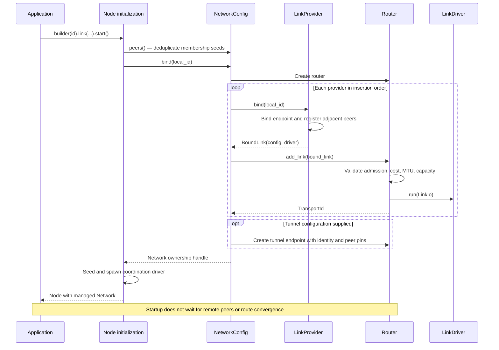
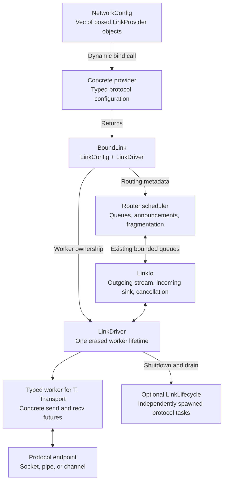
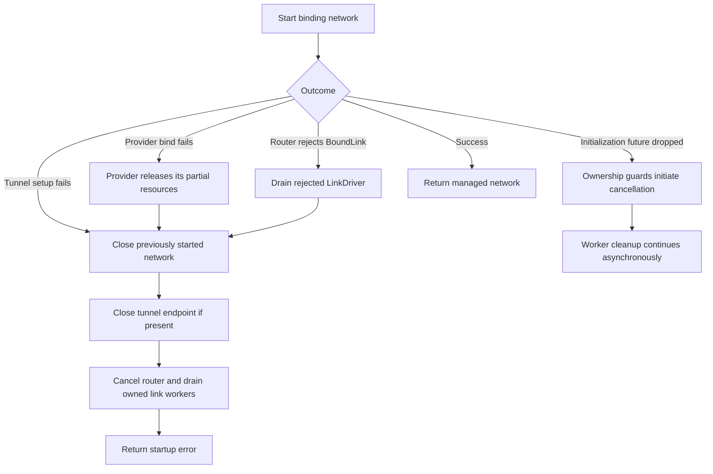
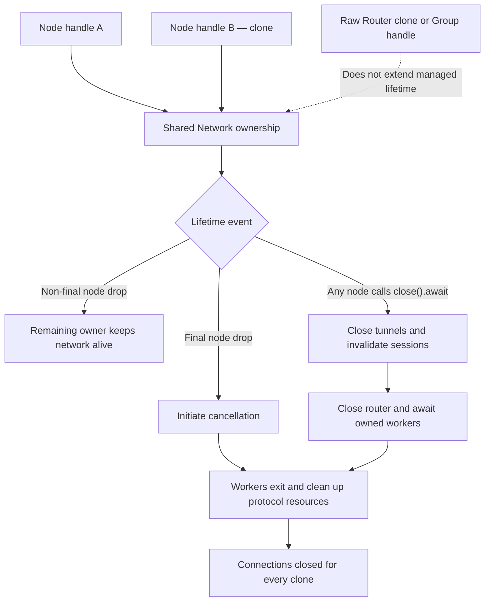

# Link registration and lifecycle

[Documentation index](README.md) · [Previous: architecture](architecture.md) · [Next: routing](routing.md)

All protocols use the same registration contract. Providers own typed addresses,
configuration, binding, and cleanup; the router owns path selection and packet
scheduling. It never needs to know whether a provider uses TCP, IPC, or an
application-defined protocol.

## Dynamic admission contract

Admission is application policy, not a property of a peer's display name or
discovery record. Dynamic links accept a claimed `NodeId` and bounded opaque
credentials through a shared asynchronous admission trait. An explicit open
policy accepts unauthenticated identities; custom policies can reject claims
or require credentials. No key pair is mandatory. Credentials on a plaintext
link are not confidential.

Successful admission binds the accepted identity to one live session. Duplicate
active identities are rejected, not replaced. Disconnect, expiry, cancellation,
and revocation release admission and withdraw paths through that session.
Old-session cleanup must not remove a replacement session. Resource capacity,
credential bounds, handshake deadlines, and bounded pending admission remain
library responsibilities even when the application accepts everyone.

Bootstrap addresses identify initial contacts; they do not enumerate all future
members. Only admitted adjacent peers enter routing. Discovery and forwarded
membership records never independently authorize a new adjacent connection.
Unauthenticated identifiers do not prove continuity after a session ends.

Route discovery supplies a bounded, replaceable set of bootstrap contacts, not
membership assertions. Each group contacts those peers through its own protocol;
an unrelated reachable node is not automatically a member or coordinator.
Periodic bounded exchanges retry lost bootstrap traffic and permit reconnection
despite retained dead-member tombstones.

Already-bound managed TCP and connectivity-backed TCP/UDP adapters expose
`into_bound_link(cost)`, transferring session registry and shutdown lifecycle
together. The connectivity library itself never registers a router link.
It owns live paths, candidate checks, refresh and relay fallback; the protocol
adapter owns transport integration. Do not reconstruct dynamic adapters as
static links from a copied peer list. Custom dynamic
transports attach `SessionRegistry` through `BoundLink::with_sessions`, tag
incoming frames at their producing session, and implement `send_admitted` to
preserve the router-selected generation through queued physical writes.
The default static send drops tagged traffic rather than silently retargeting it.

## 1. Successful managed-node startup

`Node::builder(id).link(provider)` and `.links(providers)` populate one
heterogeneous collection. Membership settings live on that same builder.
Providers bind in insertion order; their explicit adjacent peers become initial
membership seeds. `NetworkConfig::with_link` / `with_links` configure standalone
networks without coordination actors.

The single `NodeBuilder` exposes `.config(...)`, `.seed(...)`, `.named_seeds(...)`,
and timing setters alongside link/routing/tunnel settings. Startup is fallible
and asynchronous; there is no direct-transport or blocking node constructor.

## 2. Where dynamic dispatch stops

The registration and worker-lifetime boundaries are erased. Inside the worker,
`T: Transport` is concrete: individual `send` and `recv` futures are not boxed.
The router's existing queues provide the bounded scheduling boundary.

`Outbound` preserves either shared frame storage or an owned fragment allocation
across the boundary. This is not a claim that the entire routing/TLS stack is
zero-copy. `LinkIo` must preserve backpressure; it does not add another packet
queue. Socket-only adapters need no separate `LinkLifecycle`; TCP, IPC, and
punching use it to cancel and drain independently spawned tasks.

Address hints use a weak `LinkControl` handle to the concrete worker. DNS and
gossip updates reach only links that already admit the hinted identity, even
before a route is learned. These control handles do not retain endpoints after
shutdown and do not add a per-packet queue or boxed packet future.

## 3. Startup failures and cancellation

Failure must not strand an already-bound listener. A rejected `BoundLink` is
drained before registration returns an error. A later failure closes the
previously started network before startup returns that error.

Dropping a future cannot await cleanup. Use explicit `close().await` when the
caller needs completion, such as knowing a listener is available for rebinding.
Providers themselves must also release partial resources if binding is cancelled.

## 4. Shared ownership and shutdown

Ordinary node clones retain the same network. A raw router clone or a `Group`
handle does **not** keep a managed network alive after the final node owner drops.
The receive loop does not own the managed network, avoiding a self-retaining task.

Explicit close waits for network task completion. Group handles can remain
readable after network closure but cannot exchange further messages. This
ownership diagram describes managed nodes, not independently constructed raw
routers.

## Implementation references

- [Node builder and startup](../crates/groupnet-runtime/src/node/builder.rs)
- [Clone-facing network API](../crates/groupnet-runtime/src/network.rs)
- [Startup rollback and shared network lifetime](../crates/groupnet-network/src/config.rs)
- [Provider, driver, and lifecycle contracts](../crates/groupnet-transport/src/link.rs)
- [Concrete packet worker](../crates/groupnet-transport/src/link/worker.rs)
- [Router registration and close synchronization](../crates/groupnet-network/src/router.rs)
