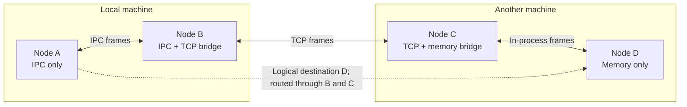
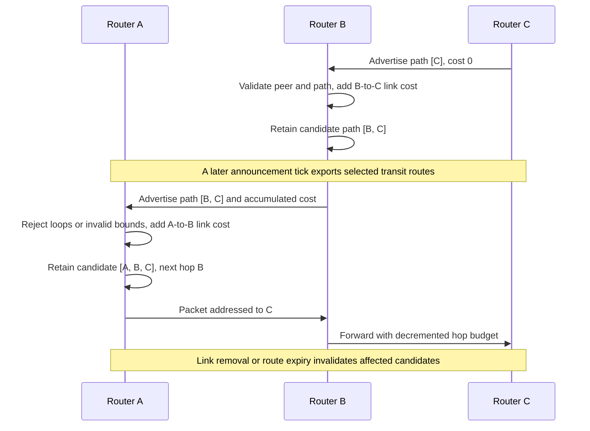
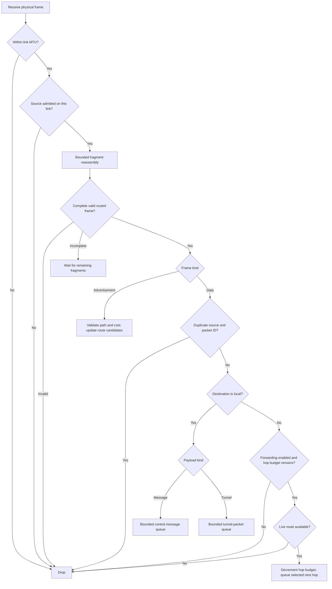

# Routing diagrams

[Documentation index](README.md) · [Previous: registration and lifecycle](link-lifecycle.md) · [Next: tunnels and security](tunnels-and-security.md)

The router builds a network from adjacent-peer links. A destination is a logical
`NodeId`; a selected route contains its next hop, link, cost, and path. Route
discovery is asynchronous and separate from group membership convergence.

## 1. Bridging heterogeneous links

A node needs only its own links and explicitly configured neighbors. It does not
need the physical address of every destination. A bridge can forward between
different protocols or between neighbors on the same adapter.

Forwarding is enabled by default; there is no separate bridge mode to enable.
`RouterConfig { forwarding: false, .. }` makes an endpoint stop advertising
learned transit routes and stop forwarding transit packets. It can still send
and receive its own traffic. This flag is **not** an application access policy.

## 2. Learning a path

For an advertisement, the link must admit the sending neighbor. The path must
start with that neighbor, exclude the local node, and fit the hop bound. The
router adds the link cost and retains a timestamped candidate within its capacity
limits. The example shows eventual propagation, not one synchronous transaction.

Advertisements are not proof of cryptographic endpoint identity. Route inspection
through `route_to` reports local routing state, not a guarantee that the next
packet will be delivered. A path can disappear immediately afterward.

## 3. Receiving and forwarding a packet

The diagram combines the worker's physical-frame check with the routing actor's
processing. Incomplete fragments wait for more data within bounded reassembly;
invalid frames are dropped. Advertisements and data then take separate paths.

Routing remains best-effort: queue saturation, a missing route, or a transport
failure can discard a frame. A successful `Transport::send` is not an
acknowledgement of remote delivery. The outgoing scheduler handles announcements,
link MTUs, fragmentation, and deadlines. Reliability for application streams is
provided by the separate [tunnel layer](tunnels-and-security.md), not by turning
all gossip into a reliable stream.

## Implementation references

- [Routes, link registration, and configuration](../crates/groupnet-network/src/router.rs)
- [Learning, replay suppression, and forwarding](../crates/groupnet-network/src/router/routing.rs)
- [Outgoing scheduling and fragmentation](../crates/groupnet-network/src/router/adapters.rs)
- [Incoming worker bounds](../crates/groupnet-transport/src/link/worker.rs)
