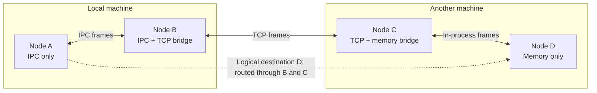
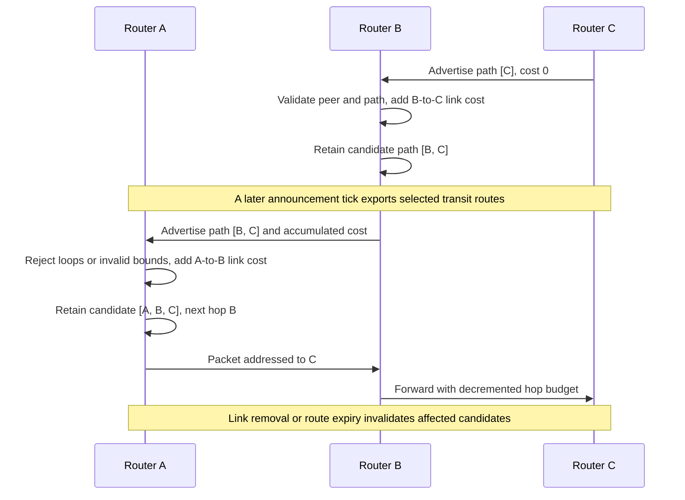
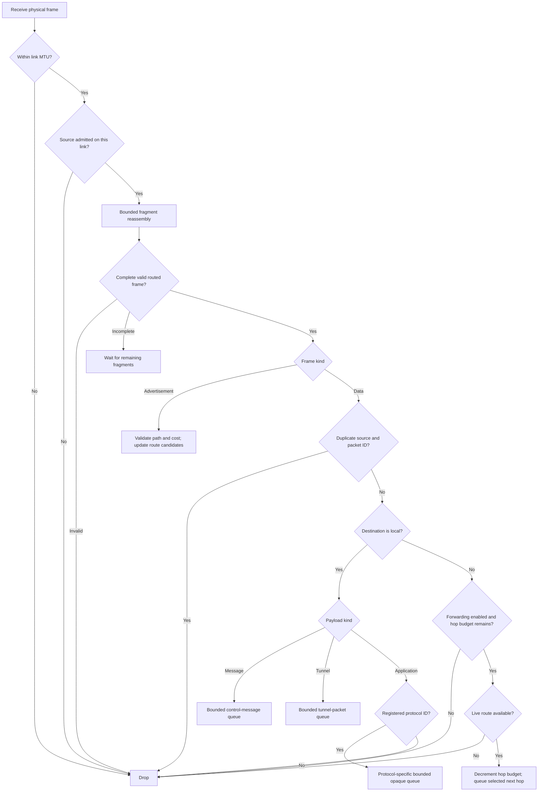

# Routing diagrams

[Documentation index](README.md) · [Previous: registration and lifecycle](link-lifecycle.md) · [Next: tunnels and security](tunnels-and-security.md)

The router builds a network from adjacent-peer links. A destination is a logical
`NodeId`; a selected route contains its next hop, link, cost, and path. Route
discovery is asynchronous and separate from group membership convergence.

## 1. Bridging heterogeneous links

A node needs only its own links and explicitly configured neighbors. It does not
need the physical address of every destination. A bridge can forward between
different protocols or between neighbors on the same adapter.

Forwarding is enabled by default; there is no separate bridge mode to enable.
`RouterConfig { forwarding: false, .. }` makes an endpoint stop advertising
learned transit routes and stop forwarding transit packets. It can still send
and receive its own traffic. This flag is **not** an application access policy.

## 2. Learning a path

For an advertisement, the link must admit the sending neighbor. The path must
start with that neighbor, exclude the local node, and fit the hop bound. The
router adds the link cost and retains a timestamped candidate within its capacity
limits. The example shows eventual propagation, not one synchronous transaction.

Advertisements are not proof of cryptographic endpoint identity. Route inspection
through `route_to` reports local routing state, not a guarantee that the next
packet will be delivered. A path can disappear immediately afterward.

`Router::reachable()` is the route-readiness notification: a watch of the
destinations that currently have a live route. Wait on it, for example
`reachable().wait_for(|peers| peers.contains(&target))`, before sending or
connecting instead of polling `route_to`.

## 3. Receiving and forwarding a packet

The diagram combines the worker's physical-frame check with the routing actor's
processing. Incomplete fragments wait for more data within bounded reassembly;
invalid frames are dropped. Advertisements and data then take separate paths.

Routing remains best-effort: queue saturation, a missing route, or a transport
failure can discard a frame. A successful `Transport::send` is not an
acknowledgement of remote delivery. The outgoing scheduler handles announcements,
link MTUs, fragmentation, and deadlines. Reliability for application streams is
provided by the separate [tunnel layer](tunnels-and-security.md), not by turning
all gossip into a reliable stream.

Application frames use `groupnet-messaging` above protocol namespace 1 for explicit
`Delivered` / `Applied` acknowledgements and bounded retry/deduplication state.
Authenticated unordered sessions use namespace 2 through `groupnet-streams`.
`Router::bind_protocol(id)` exclusively registers an endpoint; its `ProtocolIo`
shares a bounded queue and cancellation lifecycle. `RouterConfig::max_protocols`
and `protocol_queue` default to 32 namespaces and 128 packets per namespace;
unknown namespaces fail closed.
The router neither decodes protocol bodies nor interprets their ACKs.
`GNR3` carries the protocol ID; communicating nodes must upgrade together.

## Packet storage and resource policy

`RouterConfig` controls complete-frame size, hop count, replay retention,
reassembly bounds, protocol/inbox/link capacities and physical-send deadlines.
Configuration is validated against wire representation before workers start;
every queue capacity is a `QueueCapacity`, which is nonzero and representable
by Tokio channels by construction. Increasing a bound does not enlarge a
physical link's MTU: fragmentation still applies, and every receiving router
enforces its own limits.

| Queue | Default | Holds |
|---|---|---|
| `link_queue` | 4096 per link | Frames awaiting that link's worker |
| `event_queue` | 256 per node | Link lifecycle and neighbor events awaiting the routing actor (backpressured) |
| `message_queue` | 64 per node | Coordination messages awaiting the runtime |
| `protocol_queue` | 128 per namespace | Application packets awaiting the bound protocol |

Each link worker processes the frames it reads inline — admission, reassembly,
route learning, replay suppression, then delivery or forwarding — so a data
frame crosses no routing-actor queue. A link worker also offers the transport
a synchronous `InboundSink` (`Transport::attach_inbound`); admitted and raw
`TcpMsgTransport` readers adopt it and run the same inline processing on the
socket reader task, charging Tokio's cooperative budget per frame and reading
no further input while a frame is processed. Locally addressed tunnel packets go
straight to their session's own bounded queue (`TunnelLimits::packet_queue`).
The routing actor keeps only the announcement clock and link lifecycle events.

Replay suppression keeps a 64-sequence sliding window per `(origin, router
nonce)` stream: a routed identity seen in the window, or older than it, is
dropped. At most `replay_capacity / 64` streams (rounded up) are tracked, least
recently active evicted first. Packet storage larger than 4 KiB comes from a
per-size-class pool and returns to it when the last `Bytes` view of the sent
packet drops; `RouterConfig::packet_pool` (default 2 MiB) bounds idle storage.

Sizing rule: one saturated tunnel stream keeps about
`TunnelLimits::stream_frames()` frames queued — a window of data plus its
acknowledgements. Size `link_queue` for the bulk streams sharing a link; the
default holds two default-window streams. A full link queue drops frames: streams
repair the loss, but each loss halves the affected stream's congestion window.

`ProtocolIo::packet_buffer(destination, capacity)` reserves routing headroom in
one owned buffer. A protocol writes its typed header and payload, encrypts in
place where needed, then calls `send_packet`. Routing consumes that allocation;
dispatch returns `Bytes` slices without copying the payload. `send_owned` can
transfer a local packet directly but must prepend a routing envelope for a remote
destination; protocols producing remote packets should use the headroom path.
Submission rejects a buffer whose reserved headroom does not match the sending
router's source identity length, destination, or protocol, before stamping bytes.

Transport `Inbound` and `Outbound` carry `Bytes`. The link worker passes owned
frames and their captured admission generation to `send_owned_admitted`; custom
transports may override that method to consume the allocation. Its default
borrows the existing admitted-send interface. Transit hop updates reuse uniquely
owned storage and copy only when shared ownership prevents mutation. Fragment
reassembly retains slices and performs one final contiguous assembly; physical
fragment encoding still copies each fragment's payload.

## Implementation references

- [Routes, link registration, and configuration](../crates/groupnet-network/src/router.rs)
- [Learning, replay suppression, and forwarding](../crates/groupnet-network/src/router/routing.rs)
- [Outgoing scheduling and fragmentation](../crates/groupnet-network/src/router/adapters.rs)
- [Incoming worker bounds](../crates/groupnet-transport/src/link/worker.rs)
