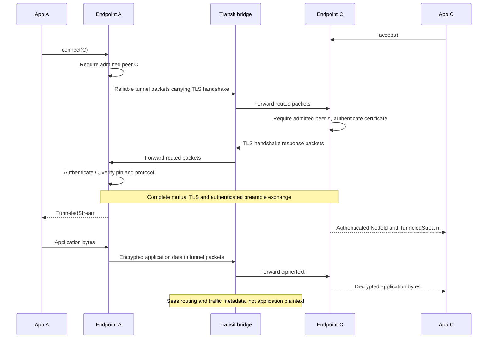
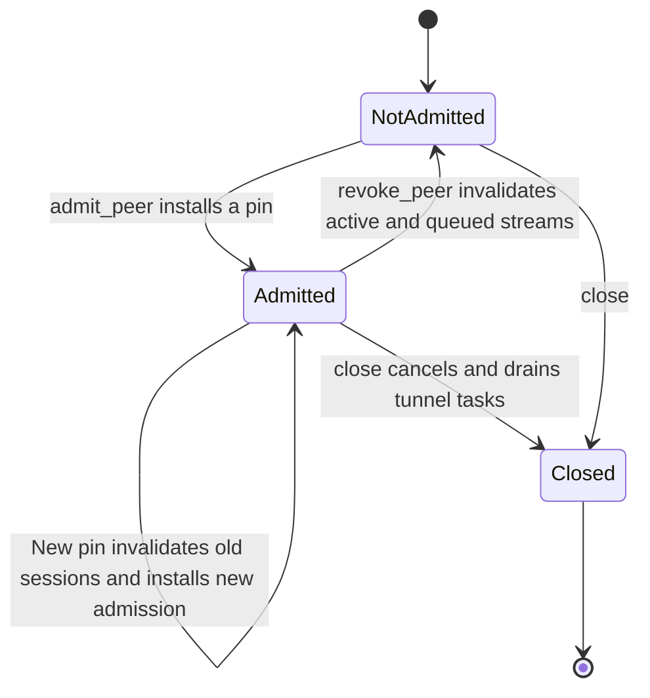
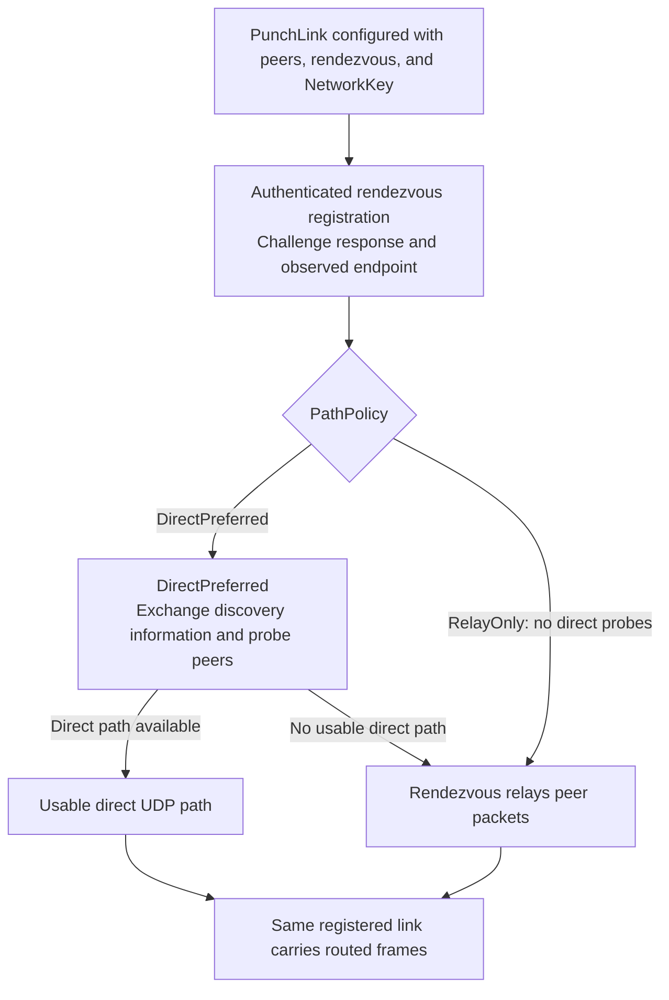
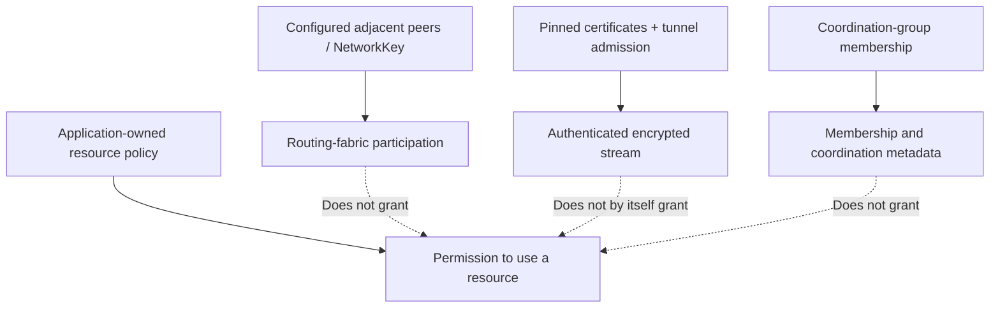

# Tunnels and security boundaries

[Documentation index](README.md) · [Previous: routing](routing.md)

Reachability, routing-fabric trust, tunnel identity, and application authorization
are different decisions. Coordination-group membership does not grant permission
to open a protected resource.

## 1. Authenticated streams across a bridge

Both endpoints configure a `TlsIdentity` and explicit `PeerIdentity` certificate
pins. `Node` and standalone `Network` implement `BulkTransport` through
this tunnel endpoint. Without tunnel configuration, `connect` and `accept` return
`Unsupported`; there is no plaintext fallback.

TLS 1.3 authenticates the endpoints, not each intermediate bridge. Certificates
must include the `groupnet.peer` DNS SAN and client/server authentication usages.
The reliable tunnel transport supplies ordered segments, acknowledgements,
receive credit, retransmission, and congestion control below TLS. A changed route
does not itself create a new application stream or replay delivered application
bytes. This is not a guarantee of availability through arbitrary outages.

### Reliable stream contract

- Bounded ordered segments use cumulative acknowledgements and receive credit.
- RTT-based retransmission deadlines and duplicate-ACK gap repair handle loss;
  additive-increase/multiplicative-decrease controls congestion.
- A retry keeps its tunnel sequence number but uses a fresh router packet ID.
  Router replay suppression therefore does not discard legitimate retries.
- FIN closes one stream direction. The other remains usable until it closes
  independently; a half-close can still receive a response.
- Route changes select another next hop below the existing authenticated
  session. They do not terminate TLS or restart application delivery.

## 2. Peer admission and revocation

Admission is local and bidirectional: it permits this tunnel endpoint to connect
to or accept that peer. The other endpoint must independently admit the matching
identity. It is not a directional permission-group policy.

New sessions after pin replacement must authenticate against the new admission.
Revocation does not retract routes, rotate a shared network key, or revoke an
application's USB ownership. Applications still need their own resource policy.

## 3. Native discovery, direct paths, and relay

`PunchLink` uses an explicitly started, self-hosted `Rendezvous`. In keyed mode,
the shared `NetworkKey` authenticates the routing fabric. Registration includes
a challenge response tied to the observed source address; leases, admission,
replay checks, and bounds constrain discovery and relay traffic.

Dynamic admission is distinct from tunnel certificate admission. An explicit
open policy permits previously unknown routing identities without a key pair.
Custom policies can require application credentials. A claimed identity and a
return-routability check do not authenticate a person or prove identity continuity.
Never send reusable secrets over an unencrypted admission exchange.

The following diagram describes the keyed path; open admission does not acquire
shared-key authentication merely by using the same routing layer.

This is a path-selection overview, not the packet-level rendezvous state machine.
Not every NAT permits a direct path. The rendezvous must be reachable for the
configured operation; there is no implicit public relay service. Shared-key
routing authentication is not confidentiality: use pinned TLS tunnels for
protected application bytes. Shared-key holders are trusted and can impersonate
routing aliases; the fabric is not Byzantine-safe.

## 4. What each security layer actually grants

These are separate checks, not one inherited permission chain. Applications must
bind their authorization decisions to authenticated identities, not to a claimed
routing alias or advertised group name.

| Boundary | Implemented guarantee or limitation |
|---|---|
| Plain TCP/UDP links | No inherent endpoint authentication or encryption; static configurations assume trusted peers. |
| Open dynamic admission | Accepts claimed identities without ownership proof; session binding is not account authentication. |
| Native punching fabric | Keyed mode authenticates fabric membership; explicit keyless mode does not. |
| Pinned TLS tunnels | End-to-end endpoint identity and application-byte confidentiality across transit peers. |
| Transit bridges | Can observe routing/traffic metadata and deny service. |
| Application resources | Authorization and exclusive ownership remain the application's responsibility. |
| Permission groups and private-peer discovery | Not implemented; ordinary coordination groups are not security groups. |

Public-Internet NAT combinations, Unix runtime behavior, and physical USB/YubiKey
operation require deployment-specific qualification. The existing Windows
loopback smoke coverage does not establish those guarantees.

## Implementation references

- [Tunnel establishment, admission, revocation, and close](../crates/groupnet-network/src/tunnel.rs)
- [Native punching implementation crate](../crates/groupnet-transport-punch)
- [Configuration and public stream API](../README.md#node-owned-heterogeneous-connections)
