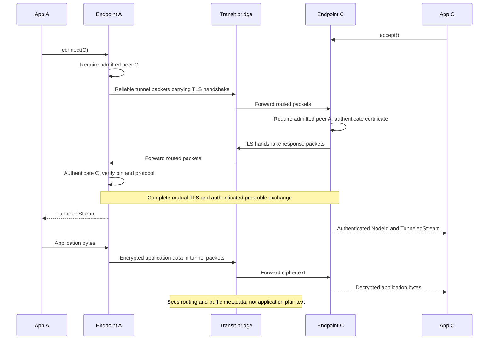
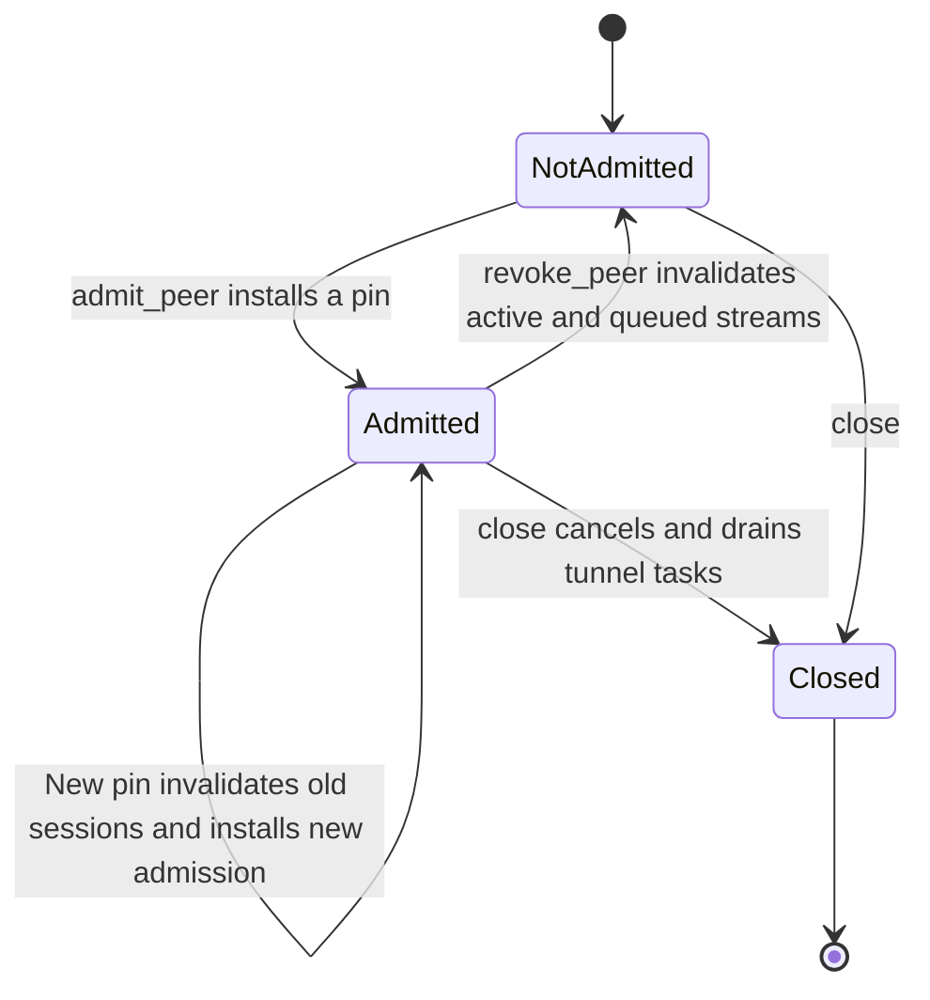
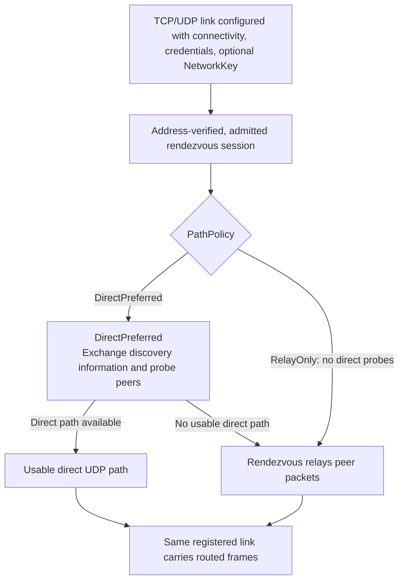
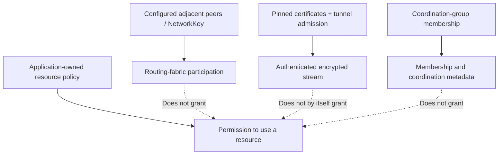

# Tunnels and security boundaries

[Documentation index](README.md) · [Previous: routing](routing.md)

Reachability, routing-fabric trust, tunnel identity, and application authorization
are different decisions. Coordination-group membership does not grant permission
to open a protected resource.

## 1. Authenticated streams across a bridge

Both endpoints configure a `TlsIdentity` and explicit `PeerIdentity` certificate
pins. `Node` and standalone `Network` implement `BulkTransport` through
this tunnel endpoint. Without tunnel configuration, `connect` and `accept` return
`Unsupported`; there is no plaintext fallback.

TLS 1.3 authenticates the endpoints, not each intermediate bridge. Certificates
must include the `groupnet.peer` DNS SAN and client/server authentication usages.
The reliable tunnel transport supplies ordered segments, acknowledgements,
receive credit, retransmission, and congestion control below TLS. A changed route
does not itself create a new application stream or replay delivered application
bytes. This is not a guarantee of availability through arbitrary outages.

### Reliable stream contract

- Bounded ordered segments use cumulative acknowledgements and receive credit.
  Every reliability packet starts with tunnel version byte `3` (also the
  `GN-TUNNEL-3` preamble); other versions are discarded, never misparsed.
- Credit is counted in bytes of retained segment cost: each segment costs its
  ciphertext plus the 38-byte reliability header. Every packet carries a `u32`
  credit relative to its cumulative acknowledgement. A sender keeps the cost of
  unacknowledged segments plus the next segment within the newest credit, and
  its unacknowledged segment count within the congestion window. Credit is
  taken only from the highest acknowledgement seen (at an equal acknowledgement,
  only a larger credit), so a reordered stale acknowledgement never extends it.
- Each endpoint reads TLS ciphertext into segments of at most its configured
  `payload` (its send segment), shortened to fit the remaining credit; while
  segments are unacknowledged it waits for a full segment's credit instead of
  sending a shorter one. Every receiver accepts any segment up to the
  protocol-wide `SegmentSize::MAX` (64,936 bytes: the default 65,000-byte routing
  envelope minus the smallest tunnel envelope and the reliability header), so
  peers may choose different segment sizes and windows.
- The receiver advertises only bytes it has reserved. Its advertised right edge
  (acknowledged position plus credit) never moves backwards except through the
  idle relinquish below, so data a sender transmits within credit is always
  held, never dropped for lack of memory. Data beyond credit is discarded.
- Slow start opens the congestion window from `initial_congestion` by two
  segments per acknowledged segment, tripling it every round trip (close to
  BBR's startup gain), until the slow-start threshold (initially
  `max_window / payload` segments), loss, or queueing delay. A larger credit at
  the same cumulative acknowledgement is a window update sent as data is
  delivered, never a duplicate.
- Queueing delay is controlled Vegas-style, so a window larger than the path
  never becomes a standing queue (bufferbloat). The base round trip is the
  windowed minimum sample of the last ten seconds. A round lasts until
  everything sent when it began is acknowledged, or twice the base round trip,
  whichever is first; from the round's smallest sample the sender estimates
  queued segments as `in_flight × (rtt − base) / rtt`. The tolerated queue is
  the segments worth a target delay — the larger of 250 µs and an eighth of the
  base round trip — or two segments. The target keeps round-trip jitter (timer
  granularity, scheduler wakes of tens of microseconds per hop) from being read
  as a queue, and bounds a WAN queue to a fraction of its round trip. The time
  bound on rounds sees a queue that builds within one long burst.
- Once a round has eight samples, more than the tolerated queue ends slow
  start, cutting the window to the estimated path capacity (in flight minus
  queued) plus the tolerated queue. Afterwards each round grows a window it used
  (at least half in flight) by a quarter while less than half the tolerated
  queue builds and by one segment while less than all of it does; above twice
  it (at least four segments) the window is cut the same way, by at most half.
  The round after a cut carries segments sent before it and is not measured.
  `max_window` therefore bounds memory and the bandwidth-delay product
  reachable, not the queue a stream builds.
- Loss — three duplicate acknowledgements or a retransmission timeout — sets
  the threshold and the window to half the congestion window and starts
  recovery for everything sent so far. Three duplicate acknowledgements
  retransmit the oldest unacknowledged segment; a timeout retransmits from it up
  to the congestion window. Each partial acknowledgement then retransmits the
  following segments, keeping retransmissions within the window, so every gap
  in a window is repaired at the acknowledgement clock rather than one gap per
  timeout. The window is frozen during recovery: duplicate acknowledgements
  never halve it again and acknowledgements never grow it.
- In-order data arriving together is acknowledged once (at most 16 packets per
  acknowledgement); duplicates, out-of-order segments and segments that fill a
  gap are acknowledged at once so duplicate-acknowledgement repair still works.
  Delivery to TLS announces reopened credit only when it grew by half the
  receive reservation or the last credit was below one maximal segment;
  heartbeats repair a lost announcement. A sender reads up to 16 segments of
  buffered ciphertext per wake while credit, window and memory allow.
- Retransmission timeouts follow RFC 6298: the first round-trip sample sets the
  estimate, later samples smooth it, and retransmitted segments are never
  sampled (Karn's rule). The timeout starts at one second, is floored at 200 ms
  — over reliable links a spurious retransmit duplicates data and halves the
  window — and backs off exponentially up to two seconds.
- A retry keeps its tunnel sequence number but uses a fresh router packet ID.
  Router replay suppression therefore does not discard legitimate retries.
- FIN closes one stream direction. The other remains usable until it closes
  independently; a half-close can still receive a response.
- Route changes select another next hop below the existing authenticated
  session. They do not terminate TLS or restart application delivery.

### Node memory budget

`TunnelLimits::memory_budget` bounds all retained tunnel ciphertext of one
`TunnelTransport`: unacknowledged sent segments and received segments awaiting
reordering or delivery to TLS, in both directions of every session.

- Each session holds a guaranteed floor of `min_window` bytes per direction from
  admission until it ends. Validation requires
  `memory_budget >= max_sessions × 2 × min_window`, and the floors of sessions
  not yet admitted are never lent out, so a new session always gets its floor and
  every session progresses on it alone, even when the rest of the budget is held
  by others.
- Above the floor a direction grows opportunistically, without waiting, from the
  shared remainder up to `max_window`. A sender reserves before reading a segment
  and returns the reservation as acknowledgements free segments. A receiver grows
  by seven times each in-order segment it accepts, so its credit grows eightfold
  every round trip — ahead of a sender's slow start even from the floor — while
  the application keeps up; when the shared remainder is exhausted it keeps
  advertising what it already holds.
- A sender that has sent no data for `heartbeat_interval` with nothing
  unacknowledged relinquishes its credit with a sequenced, empty `Idle` segment
  and takes no further credit until that segment is acknowledged. Processing it
  in order, the receiver releases its reservation down to the floor (and to what
  it still buffers), returning memory to other sessions. Because credit is taken
  only from acknowledgements beyond the `Idle` segment, no data is in flight
  under the released credit.
- Reservations never wait, so acknowledgement, retransmission and heartbeat
  processing never block on memory. `TunnelTransport::reserved_memory()` reports
  the bytes currently reserved.

`TunnelConfig::with_limits(TunnelLimits { .. })` configures peer/session admission,
the accept queue, TLS buffering, send segment, windows, memory budget, initial
congestion window and setup/retransmission/heartbeat deadlines. Standalone
endpoints use `TunnelTransport::with_limits`. Each field's range is its type:
`QueueCapacity` for the accept queue, `SegmentSize` for the send segment,
`NonZeroU32` for the byte windows (the wire's u32 credit), nonzero counts and
budget, and `RetransmitTimeouts`, whose constructor orders `min <= initial <= max`
once. `TunnelLimits::validate` checks only cross-field relations: sessions per
peer within `max_sessions`; `payload + 38 <= min_window <= max_window`; the
budget covering every floor; initial congestion within `max_window / payload`
segments; and a peer timeout longer than both the heartbeat interval and the
retransmission cap. TLS ciphertext is initially read into routing-headroom
storage; retransmissions retain ciphertext rather than re-encrypting application
bytes.

| `TunnelLimits` field | Default |
|---|---|
| `payload` (send segment) | 16 KiB |
| `min_window` / `max_window` (per direction) | 128 KiB / 16 MiB |
| `memory_budget` (per transport) | 128 MiB |
| `initial_congestion` | 4 segments |
| `retransmit` | 200 ms minimum, 1 s initial, 2 s maximum |
| `stream_buffer` | 32 KiB per direction |
| `max_peers` / `max_sessions` / `sessions_per_peer` | 128 / 64 / 8 |
| `accept_queue` | 32 per namespace |
| `setup_timeout` / `peer_timeout` / `heartbeat_interval` | 10 s / 20 s / 1 s |

A 16 MiB window sustains about 1.6 Gbit/s at an 80 ms round trip, covering a
1 Gbit/s × 100 ms path with one stream. The default budget guarantees 16 MiB of
floors (64 sessions × 2 × 128 KiB) and lends the remaining 112 MiB, enough for
seven directions at full window at once. Paused-clock regression tests move
16 MiB each way across an 80 ms, 1 Gbit/s link with 4 ms of delay jitter within
eight round trips per direction (about six in practice; the former 1 MiB window
needs more than sixteen, and the former two-segment slow-start exit stalled one
direction past twelve), and move 8 MiB twice across an 80 ms, 100 Mbit/s link:
slow start overshoots by under three round trips of queue (about 190 ms), and
the warmed transfer keeps the link queue below one round trip (about 50 ms;
hundreds of milliseconds without delay control).

Memory per transport is bounded by `memory_budget` of retained ciphertext, plus
per session one `payload` read buffer, `2 × stream_buffer` of TLS buffering, and
the inbound packet queue, `TunnelLimits::packet_queue()` = `2 × max_window /
payload + 16` packets (2,064), derived rather than configured. Queued packets
from an honest peer lie within its credit and are already covered by the
reservation; arrivals beyond the queue are loss. A peer sending much smaller
segments than the local `payload` may overflow the queue and see loss.

The router's per-link `link_queue` is sized from the same defaults: one
saturated stream keeps about `TunnelLimits::stream_frames()` =
`2 × max_window / payload` frames queued (a window of data plus its
acknowledgements, 2,048 by default). Tunnel packets are dispatched to sessions
inline from the router, without an intermediate node-wide queue. See the
[routing resource policy](routing.md#packet-storage-and-resource-policy).

### Authenticated unordered sessions

`node.endpoint(Unordered::reliable())?` or `Unordered::unreliable()` resolves a
shared unordered protocol engine behind the generic `Endpoint
` handle.
Pinned TLS is used only for setup and lifetime binding. Its setup accept queues
are distinct from ordered application accepts and demultiplexed by the bound
reliable/unreliable policy, so concurrent accepts cannot steal a different
policy's session. The authenticated `GN-TUNNEL-3` preamble selects the namespace;
unknown namespaces fail closed. Both peers must resolve the unordered protocol
and explicitly permit the requested policy in node-wide `UnorderedConfig`;
there is no silent downgrade. Binding an endpoint or peer opens no connection.

Setup binds a fresh session identity and policy to TLS-exported directional
ChaCha20-Poly1305 keys. Application messages, ACKs, heartbeats and close records
travel through routed protocol namespace 2, not through the ordered TLS stream.
Authenticated headers bind session identity, packet nonce, message identity and
record kind. Peer checks, directional keys and bounded replay windows prevent
cross-peer/session substitution and replay acceptance.

Reliable unordered messages retry independently, using the same logical message
identity and a fresh packet nonce. ACKs mean a bounded destination inbox accepted
the message; they do not mean application processing or persistence. Lost earlier
messages do not hold up later arrivals. Sending is bounded by pending capacity,
the reliable sequence horizon, finite attempts and a deadline; timeout leaves
acceptance unknown. Unreliable data has no ACK or added retransmission.
Both modes preserve message boundaries and impose no application delivery order.

The retained control stream ties keys to pinned admission. Revocation, endpoint
shutdown, final session-handle drop, or liveness expiry cancels affected sessions
and blocked operations. A replacement session has fresh identity and keys; it
does not resume an old conversation. Transit peers can still drop, delay or
reorder traffic and observe routing/traffic metadata.

An unreliable policy does not prohibit underlying TCP links, which retain TCP
ordering and retransmission. Strict UDP-only route selection and VPN/TUN/game
adapters are not supplied by this session API.
See [usage and default bounds](../README.md#typed-message-and-session-protocols).

## 2. Peer admission and revocation

Admission is local and bidirectional: it permits this tunnel endpoint to connect
to or accept that peer. The other endpoint must independently admit the matching
identity. It is not a directional permission-group policy.

New sessions after pin replacement must authenticate against the new admission.
Revocation does not retract routes, rotate a shared network key, or revoke an
application's USB ownership. Applications still need their own resource policy.

## 3. Native discovery, direct paths, and relay

`UdpLink::connectivity` uses an explicitly started, self-hosted `Rendezvous`. In keyed mode,
the shared `NetworkKey` authenticates the routing fabric. Registration includes
a challenge response tied to the observed source address; leases, admission,
replay checks, and bounds constrain discovery and relay traffic.

Dynamic admission is distinct from tunnel certificate admission. An explicit
open policy permits previously unknown routing identities without a key pair.
Custom policies can require application credentials. A claimed identity and a
return-routability check do not authenticate a person or prove identity continuity.
Never send reusable secrets over an unencrypted admission exchange.

**Keyless** specifically means no provisioned `NetworkKey` (`key: None`); no
public/private key pair is required by the connection library either. It does
not forbid application credentials or separately authenticated TLS streams.
Fresh random protocol capabilities remain mandatory internal session mechanics,
not application-managed identity keys.

Path selection is independent of admission and configured-key authentication.
`PunchConfig::open` defaults to `RelayOnly`; setting its public `policy` field to
`DirectPreferred` enables punching with relay fallback. A pair stays relay-only
if either endpoint requests it: neither endpoint is offered the other's socket
address, and neither sends or accepts direct probes/data for that pair. The
rendezvous still knows both observed addresses; relay-only is not anonymity
against the operator or a network observer.

Registration establishes a private control proof that is never included in peer
discovery records. Established rendezvous requests and responses must match that
proof before mutating session, sequence, or lease state. Direct paths additionally
exchange fresh, session-bound challenges and responder capabilities; a discovery
record alone cannot authorize direct data. Pending/confirmed state is bounded,
unproven probes cannot replace confirmed receive capabilities or advance data
replay state, and expired direct paths fall back to a live relay registration.
Reconnection revokes the old generation and its capabilities.

In keyless mode these capabilities travel without encryption. They constrain
off-path spoofing; they do not resist an observer who captures them, authenticate
a claimed identity, or make routing participants trustworthy. The rendezvous is
trusted to introduce peers. Open admission does not make the fabric Byzantine-safe.
Database engines and other consumers choose their own trust and authorization
policies; no application-specific admission policy is imposed by Groupnet.

### Native multi-candidate traversal contract

UDP and TCP connection establishment remain distinct protocol implementations
in the custom connectivity library, consumed by the actual TCP/UDP transport
adapters. The library implements neither `Transport` nor router registration.
Native candidate exchange is not ICE/STUN/TURN. Candidate
gathering, bounded session-bound checks, and stable path selection have separate
responsibilities. Working relay paths remain usable while direct checks run.
Local, observed, and explicitly configured addresses are untrusted candidates;
neither advertising an address nor receiving an unsolicited packet proves a path.
IPv4 and IPv6 candidates must be checked using compatible owned sockets.

TCP traversal requires TCP rendezvous and relay connections, independent of UDP.
Direct attempts coordinate reusable source-port connections with passive accepts
where supported by the OS. Ordinary dialing from an unrelated ephemeral port is
not evidence of TCP hole punching. Simultaneous-open and NAT behavior vary by
platform; failed direct attempts must retain relay operation, not claim success.
Neither transport provides a universal NAT traversal guarantee.

Logical route bridging is separate from adjacent connection establishment. A
memory-only node reaches a remote TCP node through an edge with both adapters.
The router can prefer a cheaper compatible admitted adjacency when one becomes
available and retain transit routes otherwise. Group membership, addresses, and
route advertisements do not grant admission or create unsupported transports.

Admission, duplicate-identity rejection, producing-session generation, and
bounded queues apply to every candidate and path. Relay-only participants do not
disclose candidate addresses or initiate direct checks. Path replacement cannot
move old queued traffic into a replacement session, and an unverified candidate
cannot replace a working path. Application encryption remains separately chosen.

Both endpoint configurations expose up to three additional candidate binds and
eight explicit advertised addresses, plus optional interface gathering. UDP
retains the separately observed mapping alongside those advertisements and caps
active candidate/socket checks at 32, rotating unvalidated checks as necessary.
Authenticated peer-reflexive sources can replace an unvalidated slot, never a
healthy selected path. UDP final data and confirmations require pair-secret MACs:
forwarding a captured authentic probe and learning its returned capability is
not sufficient to inject data or advance replay state.

TCP direct and keyed control streams derive separate transmit/receive MAC keys
and authenticate monotonic frame sequences. Reflection and replay cannot convert
locally emitted traffic into traffic attributed to the remote peer. Direct
handshakes include fresh mutual challenges, including the two-active-open case.
At most sixteen candidate dials run concurrently, with at most sixteen new checks
per second; per-tuple bursts and cooldowns prevent indefinite aggressive probing.
Rendezvous established events take precedence over unauthenticated accepts.

TCP admission lasts for the live admitted session. Losing either peer's rendezvous
connection does not revoke a healthy direct session, but disables that peer's relay
fallback and further candidate checks. The generation is withdrawn when its direct
stream closes; a fresh rendezvous admission can supersede it with a new generation.
An endpoint with a lost local control connection terminates when no usable direct
sessions remain, rather than remaining inert; callers must explicitly rebind.
UDP retains its existing rendezvous/discovery lease coupling. Neither TCP control
nor its relay is automatically TLS-encrypted or an HTTP proxy protocol.

TCP rendezvous data uses bounded backpressure by default, not a fixed packet-rate
cap. `TcpRendezvousConfig` separates control and relay-data queues, pending
admission and admitted-session capacity. `ControlRateLimit` bounds control traffic
independently; `RelayPacing::Bytes` optionally limits relay data by bytes per second
and burst bytes. Waiting for data capacity or pacing is cancellation-aware.
Choose `bind_config`, `bind_open_config`, or `bind_with_admission_config` to supply
the policy. UDP rendezvous exposes `RendezvousConfig` / `RendezvousLimits` through
`Rendezvous::bind_config`. `TcpRendezvous::closed()` resolves, stickily, once the
server task stops (after `close()`, last-handle drop, or an unexpected stop); then
`local_addr()` reports `NotConnected`. Endpoints expose the same sticky signal
through `TcpMsgTransport::closed()` and `SessionRegistry::closed()`.

The UDP rendezvous applies the same rule: its fixed 256-packet/second per-source
budget covers control and rejected relay requests only (relay toward a missing
or stale recipient session). Admitted relay data never spends it;
`RendezvousConfig::relay_pacing` (the shared `RelayPacing`, default
`Backpressure`) optionally limits it by bytes, dropping datagrams over budget, so
`burst_bytes` must hold at least one `MAX_MESSAGE`. Native TCP streams (dialed,
accepted direct and rendezvous) set `TCP_NODELAY`. `TcpRendezvousConfig`
capacities and both endpoint `queue_capacity` fields are `QueueCapacity`;
`TcpConnection::path_changes()` notifies neighbor/direct-path changes.

The following path-selection flow applies with or without a provisioned key:

This is a path-selection overview, not the packet-level rendezvous state machine.
Not every NAT permits a direct path. The rendezvous must be reachable for the
configured operation; there is no implicit public relay service. Shared-key
routing authentication is not confidentiality: use pinned TLS tunnels for
protected application bytes. Shared-key holders are trusted and can impersonate
routing aliases; the fabric is not Byzantine-safe.

The native UDP format is `GNP4`; TCP frames use version 2. Each rendezvous and
its endpoints must upgrade together. Earlier formats and authentication-mode
mismatches are rejected without compatibility fallback.

## 4. What each security layer actually grants

These are separate checks, not one inherited permission chain. Applications must
bind their authorization decisions to authenticated identities, not to a claimed
routing alias or advertised group name.

| Boundary | Implemented guarantee or limitation |
|---|---|
| Plain TCP/UDP links | No inherent endpoint authentication or encryption; static configurations assume trusted peers. |
| Open dynamic admission | Accepts claimed identities without ownership proof; session binding is not account authentication. |
| Native punching fabric | Keyed mode authenticates fabric membership; explicit keyless mode does not. |
| Pinned TLS tunnels | End-to-end endpoint identity and application-byte confidentiality across transit peers. |
| Authenticated unordered sessions | TLS-pinned setup and directional AEAD datagrams; bounded replay protection, with explicit reliable/unreliable delivery. |
| Transit bridges | Can observe routing/traffic metadata and deny service. |
| Application resources | Authorization and exclusive ownership remain the application's responsibility. |
| Permission groups and private-peer discovery | Not implemented; ordinary coordination groups are not security groups. |

Public-Internet NAT combinations, Unix runtime behavior, and physical USB/YubiKey
operation require deployment-specific qualification. The existing Windows
loopback smoke coverage does not establish those guarantees.

## Implementation references

- [Tunnel establishment, admission, revocation, and close](../crates/groupnet-network/src/tunnel.rs)
- [Typed session protocols and unordered implementation](../crates/groupnet-streams/src/lib.rs)
- [Native punching implementation crate](../crates/groupnet-transport-punch)
- [Configuration and public stream API](../README.md#node-owned-heterogeneous-connections)
